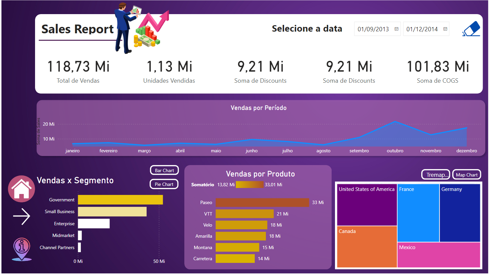
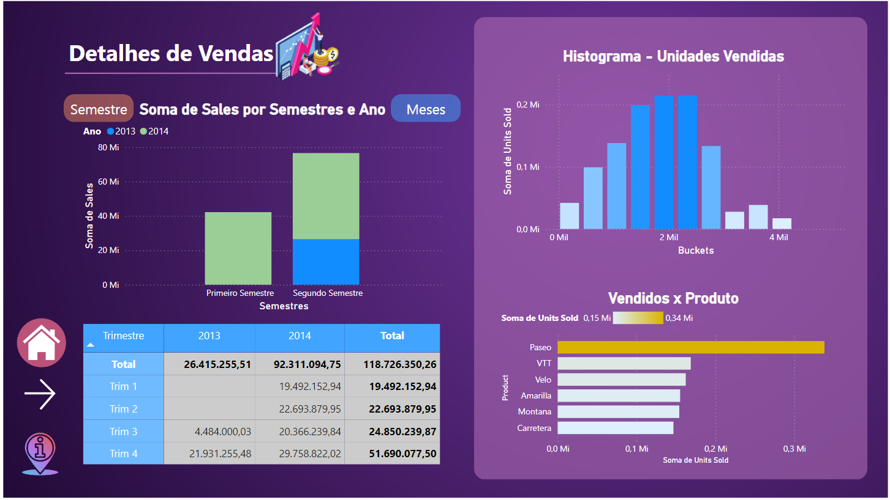
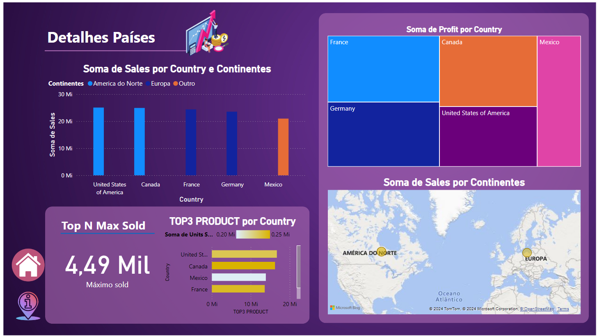

# StoryTelling_PowerBI

Repositório criado para realizar uma prática de storytelling utilizando power BI

Neste projeto a partir da página inicial e da landing page:

foi necessário criar um relatório completo utilizando tecnicas de DAX, User experience e também utilizar a criatividade para criar páginas que demonstrem dados interessantes e úteis ao usuário.

## Páginas construidas:

A primeira página construída nesse relatório foi o detalhamento das vendas totais do dataset financials disponibilizado pelo power BI.

Em seguida foi necessário de uma página para uma análise mais aprofundada nas vendas em relação aos países e os continentes em que elas ocorreram:

E por fim como dito sempre focando em uma estilizada interessante aos olhos do usuário sem interferir na visualização do dado.
Assim Foi possível criar um fluxo contínuo que consegue contar um "historia" ao cliente.
